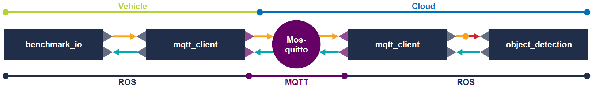
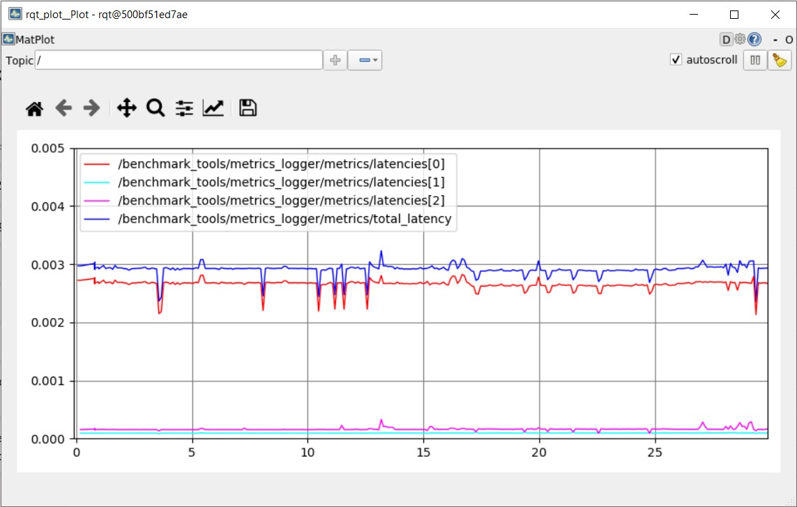
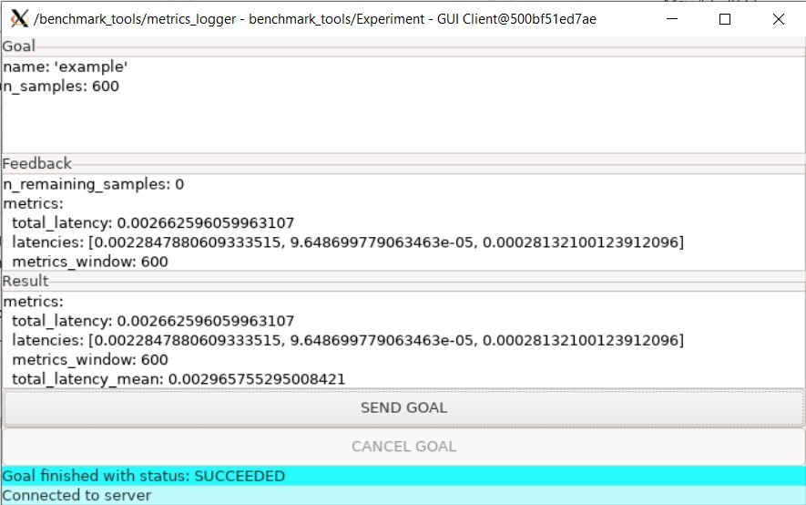

# ROS V2X Benchmarking Suite

<p align="center">
  </a>
  </a>
  </a>
</p>

The **ROS V2X Benchmarking Suite** allows users to easily send data between two connected ROS-based systems, and to benchmark the latency between these systems. Various methods to exchange data can be tested, including [`mqtt_client`](https://github.com/ika-rwth-aachen/mqtt_client), [`mqtt_bridge`](https://github.com/groove-x/mqtt_bridge), and [Docker Overlay Networks](https://docs.docker.com/network/overlay/).

---

Follow the quick start guide in this README to quickly benchmark the latency in your network, including a live plot of latencies. The guide also allows you to easily re-run experiments from our paper for which we have developed this benchmarking suite.

As part of our work, we have developed and released a novel MQTT-based communication interface for ROS: the [`mqtt_client`](https://github.com/ika-rwth-aachen/mqtt_client) package enables multiple connected ROS-based devices or robots to easily exchange data at low latencies using the MQTT protocol.

In our paper, we present an in-depth analysis of using the new interface and presented alternatives for a promising use case in automated driving, namely edge-cloud lidar object detection. More details are found in [Use Case](#use-case-5g-edge-cloud-lidar-object-detection).

> **Enabling Connectivity for Automated Mobility: A Novel MQTT-based Interface Evaluated in a 5G Case Study on Edge-Cloud Lidar Object Detection**
> ([arXiv](https://arxiv.org/abs/2209.03630), [ResearchGate](https://www.researchgate.net/publication/363366074_Enabling_Connectivity_for_Automated_Mobility_A_Novel_MQTT-based_Interface_Evaluated_in_a_5G_Case_Study_on_Edge-Cloud_Lidar_Object_Detection))
>
> [Lennart Reiher](https://www.ika.rwth-aachen.de/de/institut/team/lennart-reiher-msc.html), [Bastian Lampe](https://www.ika.rwth-aachen.de/en/institute/staff/bastian-lampe-m-sc.html), [Timo Woopen](https://www.ika.rwth-aachen.de/de/institut/leitung/timo-woopen-msc.html), [Raphael van Kempen](https://www.ika.rwth-aachen.de/de/institut/team/raphael-van-kempen-msc.html), [Till Beemelmanns](https://www.ika.rwth-aachen.de/de/institut/team/till-beemelmanns-msc.html), and [Lutz Eckstein](https://www.ika.rwth-aachen.de/en/institute/management/univ-prof-dr-ing-lutz-eckstein.html)  
> [Institute for Automotive Engineering (ika), RWTH Aachen University](https://www.ika.rwth-aachen.de/en/)
> 
> <sup>*Abstract* - Enabling secure and reliable high-bandwidth low-latency connectivity between automated vehicles and external servers, intelligent infrastructure, and other road users is a central step in making fully automated driving possible.
> The availability of data interfaces, which allow this kind of connectivity, has the potential to distinguish artificial agents' capabilities in connected, cooperative, and automated mobility systems from the capabilities of human operators, who do not possess such interfaces.
> Connected agents can for example share data to build collective environment models, plan collective behavior, and learn collectively from the shared data that is centrally combined.
> This paper presents multiple solutions that allow connected entities to exchange data. In particular, we propose a new universal communication interface which uses the Message Queuing Telemetry Transport (MQTT) protocol to connect agents running the Robot Operating System (ROS). Our work integrates methods to assess the connection quality in the form of various key performance indicators in real-time.
> We compare a variety of approaches that provide the connectivity necessary for the exemplary use case of edge-cloud lidar object detection in a 5G network. We show that the mean latency between the availability of vehicle-based sensor measurements and the reception of a corresponding object list from the edge-cloud is below 87ms. All implemented solutions are made open-source and free to use.</sup>

---

- [Use Case: 5G Edge-Cloud Lidar Object Detection](#use-case-5g-edge-cloud-lidar-object-detection)
- [Prerequisites](#prerequisites)
- [Installation](#installation)
- [Setup](#setup)
- [Launch](#launch)
  - [`mqtt_client`](#mqtt_client)
  - [`mqtt_bridge`](#mqtt_bridge)
  - [`overlay`](#overlay)
  - [`in_vehicle`](#in_vehicle)
- [Monitoring](#monitoring)
  - [CLI Output](#cli-output)
  - [Plotting](#plotting)
  - [Running Experiments](#running-experiments)
- [Cleanup](#cleanup)
- [Acknowledgements](#acknowledgements)
---
- [Configuration → `CONFIGURATION.md`](CONFIGURATION.md)
- [Paper Experiments → `EXPERIMENTS.md`](EXPERIMENTS.md)
- [Development and Customization → `DEVELOPMENT.md`](DEVELOPMENT.md)


## Use Case: 5G Edge-Cloud Lidar Object Detection

The benchmarking suite is built around a promising use case in automated driving: 5G-enabled edge-cloud lidar object detection. This scenario is presented in the following. Please note that you can still use the benchmarking suite for latency measurements, even if the implemented scenario does not match your main area of interest.

An automated vehicle running ROS is connected to a powerful edge-cloud server via 5G. The vehicle transmits point clouds to the server, where an artificial neural network processes the data and computes lists of objects detected in the point clouds. The object lists are transmitted back to the vehicle, where they could be incorporated into vehicle functions such as behavior planning.

The data flow for the [`mqtt_client`](https://github.com/ika-rwth-aachen/mqtt_client) method is illustrated below. The data flow for other methods is similar and is described in more detail in our paper.



1. A point cloud (`velodyne_msgs::VelodyneScan`) is published on the vehicle.
2. The point cloud ROS message is subscribed by an instance of `mqtt_client`, which serializes the message and publishes it to an MQTT broker, e.g., [*Mosquitto*](https://mosquitto.org/).
3. On the cloud server, another instance of `mqtt_client` subscribes to the MQTT message and re-publishes it to the ROS network.
4. A neural network-based object detection algorithm detects objects in the point cloud and publishes a ROS object list message. Note that this component is realized as a dummy in the benchmarking suite, i.e., the object detection simply adds some constant processing delay before then publishing a fixed object list message.
5. In the same way as the point cloud, the object list is transmitted back to the vehicle via the two `mqtt_client` instances.
6. At every component, in- and out-timestamps are logged. These timestamps are aggregated on the vehicle computer in order to compute partial and total latencies.


## Prerequisites

- One computer that acts as the *Vehicle*
- One computer that acts as the *Cloud* (can be the same as *Vehicle* if you just want to get to know the benchmarking suite)
- *Vehicle* and *Cloud* must be connected via any network, i.e., *Vehicle* can ping *Cloud* and vice-versa
- [Docker](https://www.docker.com/) installed on both *Vehicle* and *Cloud*


## Installation

These steps need to be performed on both vehicle *and* cloud computers, if they are separate machines.

<details style="margin-left: 20px">
<summary><i>Cloud & Vehicle</i></summary>

1. Clone the repository including all submodules.
    ```bash
    git clone --recurse-submodules https://github.com/ika-rwth-aachen/ros-v2x-benchmarking-suite.git
    ```
1. Build the execution Docker image, which contains the pre-built ROS workspace.
    ```bash
    # ros-v2x-benchmarking-suite/
    docker build -f docker/Dockerfile -t ros-v2x-benchmarking-suite .
    ```
1. *(optional)* Build the development Docker image, which contains all required dependencies to compile the ROS workspace, if mounted into a container. See [Development and Customization → `DEVELOPMENT.md`](DEVELOPMENT.md).
    ```bash
    # ros-v2x-benchmarking-suite/
    docker build -f docker/Dockerfile --target development -t ros-v2x-benchmarking-suite:dev .
    ```

</details>


## Setup

From here on, instructions are separated into steps that need to be performed on the cloud computer and steps performed on the vehicle computer.

<details style="margin-left: 20px">
<summary><i>Cloud</i></summary>

1. Create an alias for quickly starting the Docker container.
    ```bash
    # ros-v2x-benchmarking-suite/
    alias benchmark_cloud="
      docker run --rm -it \
      --name benchmarking-cloud \
      ros-v2x-benchmarking-suite"
    ```
1. Create a second alias for quickly starting the Docker container in an overlay network.
    ```bash
    # ros-v2x-benchmarking-suite/
    alias benchmark_cloud_ol="
      docker run --rm -it \
      --name benchmarking-cloud \
      --network overlay \
      ros-v2x-benchmarking-suite"
    ```

</details>

<details style="margin-left: 20px">
<summary><i>Vehicle</i></summary>

1. Allow local connections to your Xserver. This is needed for GUI forwarding from Docker container to host. Please be aware of possible security implications ([xhost man page](https://linux.die.net/man/1/xhost)).
    ```bash
    xhost +local:
    # can be reverted by running
    # xhost -local:
    ```
1. Create an alias for quickly starting the Docker container, including access to this repository's ROS bags.
    ```bash
    # ros-v2x-benchmarking-suite/
    alias benchmark_vehicle="
      docker run --rm -it \
      --env DISPLAY \
      --volume /tmp/.X11-unix:/tmp/.X11-unix \
      --volume $(pwd)/rosbags:/root/ws/rosbags \
      --volume $(pwd)/src/benchmarking_suite/experiments:/root/ws/src/benchmarking_suite/experiments \
      --name benchmarking-vehicle \
      ros-v2x-benchmarking-suite"
    ```
1. Create a second alias for quickly starting the Docker container in an overlay network.
    ```bash
    # ros-v2x-benchmarking-suite/
    alias benchmark_vehicle_ol="
      docker run --rm -it \
      --env DISPLAY \
      --volume /tmp/.X11-unix:/tmp/.X11-unix \
      --volume $(pwd)/rosbags:/root/ws/rosbags \
      --volume $(pwd)/src/benchmarking_suite/experiments:/root/ws/src/benchmarking_suite/experiments \
      --name benchmarking-vehicle \
      --network overlay \
      --env ROS_MASTER_URI="http://benchmarking-cloud:11311" \
      ros-v2x-benchmarking-suite"
    ```

</details>


## Launch

Choose one of the methods below to launch benchmarking. Please refer to our paper for more details on the individual methods.


### `mqtt_client`

<details style="margin-left: 20px">
<summary><i>Cloud</i></summary>

1. Launch the MQTT broker [*Mosquitto*](https://mosquitto.org/).
    > **Warning**  
    > Note that the default broker configuration that we provide ([`mosquitto.conf`](src/benchmarking_suite/params/mosquitto/mosquitto.conf)) is not secure. The authentication details are publicly stated below. Anyone can connect to your broker while it is running. See [Cleanup](#cleanup) for instructions on how to shut down the broker.
    ```bash
    # ros-v2x-benchmarking-suite/
    docker run --rm -d \
    --publish 1883:1883 \
    --volume $(pwd)/src/benchmarking_suite/params/mosquitto:/mosquitto/config \
    --user $(id -u):$(id -g) \
    --name mosquitto \
    eclipse-mosquitto
    ```
2. Define the broker authentication details.
    ```bash
    BROKER_USER="ika"
    BROKER_PASS="rwth-aachen"
    ```
3. Define the broker host. The IP given below should work if only following this tutorial.
    ```bash
    BROKER_HOST="172.17.0.1" # IP of Docker host on default Docker bridge network
    ```
4. Launch all benchmark tools.
    ```bash
    benchmark_cloud roslaunch benchmarking_suite benchmark_mqtt_client.launch type:=cloud host:=$BROKER_HOST user:=$BROKER_USER pass:=$BROKER_PASS
    ```

</details>

<details style="margin-left: 20px">
<summary><i>Vehicle</i></summary>

1. Define the broker authentication details. Note that the default broker configuration that we provide ([`mosquitto.conf`](src/benchmarking_suite/params/mosquitto/mosquitto.conf)) has authentication enabled with the following details.
    ```bash
    BROKER_USER="ika"
    BROKER_PASS="rwth-aachen"
    ```
1. Define the broker host. Here, the public IP address or hostname of the cloud computer is required.
    ```bash
    BROKER_HOST="<CLOUD_IP>"
    # if vehicle = cloud, use IP of Docker host on default Docker bridge network
    # BROKER_HOST="172.17.0.1" 
    ```
1. Launch all benchmark tools.
    ```bash
    benchmark_vehicle roslaunch benchmarking_suite benchmark_mqtt_client.launch type:=vehicle host:=$BROKER_HOST user:=$BROKER_USER pass:=$BROKER_PASS
    ```

</details>


### `mqtt_bridge`

<details style="margin-left: 20px">
<summary><i>Cloud</i></summary>

1. Launch the MQTT broker [*Mosquitto*](https://mosquitto.org/).
    > **Warning**  
    > Note that the default broker configuration that we provide ([`mosquitto.conf`](src/benchmarking_suite/params/mosquitto/mosquitto.conf)) is not secure. The authentication details are publicly stated below. Anyone can connect to your broker while it is running. See [Cleanup](#cleanup) for instructions on how to shut down the broker.
    ```bash
    # ros-v2x-benchmarking-suite/
    docker run --rm -d \
    --publish 1883:1883 \
    --volume $(pwd)/src/benchmarking_suite/params/mosquitto:/mosquitto/config \
    --user $(id -u):$(id -g) \
    --name mosquitto \
    eclipse-mosquitto
    ```
2. Define the broker authentication details.
    ```bash
    BROKER_USER="ika"
    BROKER_PASS="rwth-aachen"
    ```
3. Define the broker host. The IP given below should work if only following this tutorial.
    ```bash
    BROKER_HOST="172.17.0.1" # IP of Docker host on default Docker bridge network
    ```
4. Launch all benchmark tools.
    ```bash
    benchmark_cloud roslaunch benchmarking_suite benchmark_mqtt_bridge.launch type:=cloud host:=$BROKER_HOST user:=$BROKER_USER pass:=$BROKER_PASS
    ```

</details>

<details style="margin-left: 20px">
<summary><i>Vehicle</i></summary>

1. Define the broker authentication details. Note that the default broker configuration that we provide ([`mosquitto.conf`](src/benchmarking_suite/params/mosquitto/mosquitto.conf)) has authentication enabled with the following details.
    ```bash
    BROKER_USER="ika"
    BROKER_PASS="rwth-aachen"
    ```
2. Define the broker host. Here, the public IP address or hostname of the cloud computer is required.
    ```bash
    BROKER_HOST="<CLOUD_IP>"
    # if vehicle = cloud, use IP of Docker host on default Docker bridge network
    # BROKER_HOST="172.17.0.1" 
    ```
3. Launch all benchmark tools.
    ```bash
    benchmark_vehicle roslaunch benchmarking_suite benchmark_mqtt_bridge.launch type:=vehicle host:=$BROKER_HOST user:=$BROKER_USER pass:=$BROKER_PASS
    ```

</details>


### `overlay`

*Note:* This method does not work if vehicle and cloud computer are the same.

<details style="margin-left: 20px">
<summary><i>Cloud</i></summary>

1. Initialize a [Docker swarm](https://docs.docker.com/engine/swarm/key-concepts/).
    ```bash
    docker swarm init
    ```
2. Print and copy a join token for workers to join the swarm.
    ```bash
    docker swarm join-token worker
    ```
3. Create a [Docker overlay network](https://docs.docker.com/network/overlay/) to connect multiple containers within a Docker swarm.
    ```bash
    docker network create --driver overlay --attachable overlay
    ```
4. Launch all benchmark tools.
    ```bash
    benchmark_cloud_ol roslaunch benchmarking_suite benchmark_overlay.launch type:=cloud
    ```

</details>

<details style="margin-left: 20px">
<summary><i>Vehicle</i></summary>

1. Join the Docker swarm with the join token from the cloud.
    ```bash
    docker swarm join --token <TOKEN> <HOST:PORT>
    ```
2. Launch all benchmark tools.
    ```bash
    benchmark_vehicle_ol roslaunch benchmarking_suite benchmark_overlay.launch type:=vehicle
    ```

</details>


### `in_vehicle`

<details style="margin-left: 20px">
<summary><i>Vehicle</i></summary>

1. Launch all benchmark tools.
    ```bash
    benchmark_vehicle roslaunch benchmarking_suite benchmark_in_vehicle.launch
    ```

</details>


## Monitoring

There are multiple ways to monitor and assess the metrics of an ongoing benchmarking run. Note that the measured metrics are reported in the form of a custom [`benchmarking_suite/Metrics.msg`](src/benchmarking_suite/msg/Metrics.msg) ROS message. The two most important message fields are:
- `total_latency`: total round-trip latency (in seconds) from point cloud publication to object list retrieval
- `latencies`: array of partial latencies
  - the configuration files `metrics_logger_<METHOD>.yaml` define the timestamp ROS topics that are used to compute the partial and total latencies
  - *Example:* [`metrics_logger_in_vehicle.yaml`](src/benchmarking_suite/params/metrics_logger_in_vehicle.yaml) defines that `latencies[1]` corresponds to the partial latency contributed by the object detection node

### CLI Output

Currently measured metrics are by default printed to the vehicle bash, once all benchmarking tools have been launched. See below for an exemplary output when running the `in_vehicle` benchmarking.

```
total_latency: 0.003220295999199152
latencies: [0.002924066036939621, 0.00010842600022442639, 0.00018780400569085032]
metrics_window: 69
total_latency_mean: 0.0031031358521431684
latency_means: [0.002824705559760332, 0.00010398688755230978, 0.00017444328113924712]
total_latency_median: 0.003179037943482399
latency_medians: [0.0028887870721518993, 0.00010842600022442639, 0.00018093400285579264]
total_latency_std: 0.00013706398021895438
latency_stds: [0.00012685592810157686, 6.2044618971413e-06, 1.4194126379152294e-05]
total_latency_min: 0.0025930360425263643
latency_mins: [0.002327413996681571, 9.365699952468276e-05, 0.00010955600009765476]
total_latency_max: 0.0033688710536807775
latency_maxs: [0.00311075896024704, 0.00011091699707321823, 0.0001985340059036389]
```

### Plotting

The currently measured latencies can easily be plotted using [`rqt_plot`](http://wiki.ros.org/rqt_plot). For any of the benchmarking launch commands on the vehicle computer from [Launch](#launch), simply append `gui:=true`, as in the following example.

```bash
benchmark_vehicle roslaunch benchmarking_suite benchmark_mqtt_client.launch type:=vehicle host:=$BROKER_HOST user:=$BROKER_USER pass:=$BROKER_PASS gui:=true
```



### Running Experiments

In order to benchmark a defined number of sample transmissions, it is possible to start an experiment using the ROS action client GUI that also opens when the `gui:=true` flag is passed (see [Plotting](#plotting)). Simply enter a `name` and number of samples `n_samples`, *send goal*, observe *feedback* sample metrics during the experiment, and finally capture the final *result* metrics, as in the following example screenshot.

Apart from the on-screen *result*, the final benchmark metrics are also exported to [`src/benchmarking_suite/experiments`](src/benchmarking_suite/experiments) by default:
- `<EXPERIMENT_NAME>_metrics.json` contains the final [`benchmarking_suite/Metrics.msg`](src/benchmarking_suite/msg/Metrics.msg) message
- `<EXPERIMENT_NAME>_timestamps.csv` contains all taken timestamps used to compute the metrics

Note that the experiment mechanism is based on [ROS actions](http://wiki.ros.org/actionlib), s.t. an action goal could also be [published via CLI](http://wiki.ros.org/actionlib_tutorials/Tutorials/Calling%20Action%20Server%20without%20Action%20Client).




## Cleanup

Depending on the method that was launched, you may need to shut down some running components or revert host configuration.

### Any Method

<details style="margin-left: 20px">
<summary><i>Vehicle</i></summary>

1. Revert giving local connections access to Xserver.
    ```bash
    xhost -local:
    ```

</details>

### `mqtt_client`

<details style="margin-left: 20px">
<summary><i>Cloud</i></summary>

1. Shut down the broker.
    ```bash
    docker stop mosquitto
    ```

</details>

### `mqtt_bridge`

<details style="margin-left: 20px">
<summary><i>Cloud</i></summary>

1. Shut down the broker.
    ```bash
    docker stop mosquitto
    ```

</details>

### `overlay`

<details style="margin-left: 20px">
<summary><i>Cloud</i></summary>

1. Shut down the Docker swarm.
    ```bash
    docker swarm leave -f
    ```
1. Remove the Docker overlay network.
    ```bash
    docker network rm overlay
    ```

</details>

<details style="margin-left: 20px">
<summary><i>Vehicle</i></summary>

1. Leave the Docker swarm.
    ```bash
    docker swarm leave
    ```

</details>


## Acknowledgements

This research is accomplished within the projects [6GEM](https://6gem.de/) (FKZ 16KISK036K) and [UNICAR*agil*](https://www.unicaragil.de/) (FKZ 16EMO0284K). We acknowledge the financial support for the projects by the Federal Ministry of Education and Research of Germany (BMBF).
